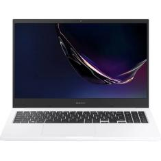
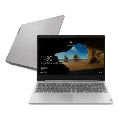
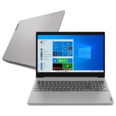
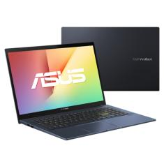

<html lang="pt-br"><head>
    <!-- Required meta tags -->
    <meta charset="utf-8">
    <meta name="viewport" content="width=device-width, initial-scale=1">
    <meta name="keywords" content="Custo benefico, notbook custo beneficio, promoção, notbooks, gamer">
    <!-- Bootstrap CSS -->
    <link href="https://cdn.jsdelivr.net/npm/bootstrap@5.1.3/dist/css/bootstrap.min.css" rel="stylesheet" integrity="sha384-1BmE4kWBq78iYhFldvKuhfTAU6auU8tT94WrHftjDbrCEXSU1oBoqyl2QvZ6jIW3" crossorigin="anonymous">
    <link type="text/css" rel="stylesheet" href="main.css">
    <title>Melhores Notbooks 2021</title>

  </head>
  <body>
    

        

            

                <object data="promotions-promotion-svgrepo-com.svg" width="44"> </object>
            

        

        

            

                
   
                    <h1>Notebooks com melhor custo benefico 2021.</h1>                
                

            

        

        <section>
            

                

                    
   
                        

                            

                                

                                    <h2>Notebook Samsung Book X30</h2>
                                    <h3>Especificações:</h3>
                                    
Notebook Samsung Book X30 NP550XDA-KF2BR Intel Core i5 1135G7 15,6" 8GB SSD 256 GB

                                
                                

                                

                                    
                                

                                

                                    <input id="a" type="submit" class="verPreco" value="Consultar preço">
                                

                            

                        

                    

                    <article>
                        
Este notebook básico de baixo custo da Samsung tem uma configuração muito razoável a um preço baixo. Primeiro, ele usa o processador intermediário Intel Core i5 de 11ª geração mais recente da marca.

                        
Memória RAM de 8 GB é muito adequada para uso básico, o que significa que mesmo se você usar vários programas ou várias guias ao mesmo tempo, sua máquina dificilmente irá travar. Claro, se você tentar executar algo que seja muito pesado ou requeira processamento gráfico, ele poderá travar.

                        
Sua tela possui resolução full HD, o que garante a qualidade de assistir filmes e séries. O armazenamento é fornecido por um SSD de 256GB, e o espaço pode não ser grande, mas é garantido que o sistema voará e as notas começarão em segundos.

                        <h3>Por que o Samsung Book X30 foi escolhido para a lista de melhor notebook custo-benefício em 2021?</h3>
                        <ul><li>Com 15,6 polegadas de tela e com resolução Full HD tem ótimo tamanho e qualidade de imagem para assistir a aulas, vídeos, filmes ou séries</li><li>Armazenamento em SSD de 256GB garante a velocidade do sistema</li><li>8GB de memória RAM dá mais liberdade para usar várias abas ou programas simultaneamente</li></ul>
                    </article>
                

            

        </section>

        <section>
            

                

                    
   
                        

                            

                                

                                    <h2>Notebook Lenovo IdeaPad S145</h2>
                                    <h3>Especificações:</h3>
                                    
Notebook Lenovo IdeaPad S145 Ideapad Intel Core i5 1035G1 15,6" 8GB SSD 256 GB Windows 10

                                
                                

                                

                                    
                                

                                

                                    <input id="a" type="submit" class="verPreco" value="Consultar preço">
                                

                            

                        

                    

                    <article>
                        
Outra série de dispositivos com vários modelos é o IdeaPad S145 da Lenovo. Entre os notebooks mais econômicos, o que mais chama a atenção é a versão equipada com processador Intel Core i5 de até 3,6 GHz-8 GB de memória RAM e 256 GB de armazenamento SSD.

                        
Isso significa que permite um bom desempenho em trabalhos leves, podendo até rodar alguns programas pesados, desde que não exija níveis elevados deles. Por outro lado, sua tela possui apenas resolução de alta definição, o que não é adequado para filmes e séries.

                        <h3>Por que o Lenovo Ideapad S145 (82DJ0003BR) é um dos melhores notebooks custo-benefício em 2021:</h3>
                        <ul><li>Tela de 15,6 polegadas é um tamanho de tela bom</li><li>Memória RAM de 8GB permite abrir uma grande quantidade abas no navegador</li><li>Armazenamento em SSD garante boa performance</li></ul>
                    </article>
                

            

        </section>

        <section>
            

                

                    
   
                        

                            

                                

                                    <h2>Lenovo IdeaPad 3i 82BS0001BR</h2>
                                    <h3>Especificações:</h3>
                                    
Notebook Lenovo IdeaPad 3i 82BS0001BR Intel Core i5 10210U 15,6" 8GB SSD 256 GB Windows 10

                                

                                

                                    
                                

                                

                                    <input id="b" type="submit" class="verPreco" value="Consultar preço">
                                

                            

                        

                    

                    <article>
                        
Para quem quer trabalhar, estudar e também jogar jogos menos pesados, que tal um notebook de nível médio com bom custo-benefício? Se este é o modelo que você está procurando, saiba mais sobre o Lenovo IdeaPad 3i 82BS0001BR. 

                        
Seu processador é o Intel Core i5 de 10ª geração, com memória RAM de 8 GB, armazenamento SSD de 256 GB e placa de vídeo GeForce MX330 dedicada. Esta placa pode executar jogos leves, embora não seja a melhor escolha para jogos muito pesados. Além disso, o design é ultrafino (muito adequado para o trabalho ou a aula). 

                        
Para quem não tem orçamento para comprar produtos top mas não desiste de comprar, o preço é muito favorável. A máquina multifuncional tem excelentes Poder de processamento.

                        <h3>Por que o Lenovo Ideapad 3i (82BS0001BR) foi escolhido para a lista de melhor notebook custo-benefício em 2021?</h3>
                        <ul><li>Boa configuração para trabalhos do dia a dia</li><li>Placa de vídeo dedicada para rodar jogos e programas de edição não tão pesados</li><li>É leve e ultrafino, excelente para quem leva o notebook na mochila com frequência</li><li>Bom preço pelo conjunto de componentes</li></ul>
                    </article>
                

            

        </section>
        <section>
            

                

                    
   
                        

                            

                                

                                    <h2>Lenovo IdeaPad 3i 82BS0001BR</h2>
                                    <h3>Especificações:</h3>
                                    
Notebook Lenovo IdeaPad 3i 82BS0001BR Intel Core i5 10210U 15,6" 8GB SSD 256 GB Windows 10

                                

                                

                                    
                                

                                

                                    <input id="c" type="submit" class="verPreco" value="Consultar preço">
                                

                            

                        

                    

                    <article>
                        
Para quem quer trabalhar, estudar e também jogar jogos menos pesados, que tal um notebook de nível médio com bom custo-benefício? Se este é o modelo que você está procurando, saiba mais sobre o Lenovo IdeaPad 3i 82BS0001BR. 

                        
Seu processador é o Intel Core i5 de 10ª geração, com memória RAM de 8 GB, armazenamento SSD de 256 GB e placa de vídeo GeForce MX330 dedicada. Esta placa pode executar jogos leves, embora não seja a melhor escolha para jogos muito pesados. Além disso, o design é ultrafino (muito adequado para o trabalho ou a aula). 

                        
Para quem não tem orçamento para comprar produtos top mas não desiste de comprar, o preço é muito favorável. A máquina multifuncional tem excelentes Poder de processamento.

                        <h3>Por que o Lenovo Ideapad 3i (82BS0001BR) foi escolhido para a lista de melhor notebook custo-benefício em 2021?</h3>
                        <ul><li>Boa configuração para trabalhos do dia a dia</li><li>Placa de vídeo dedicada para rodar jogos e programas de edição não tão pesados</li><li>É leve e ultrafino, excelente para quem leva o notebook na mochila com frequência</li><li>Bom preço pelo conjunto de componentes</li></ul>
                    </article>
                

            

        </section>
        <section>
            

                

                    
   
                        

                            

                                

                                    <h2>Asus VivoBook 15 X513EA-EJ1314T </h2>
                                    <h3>Especificações:</h3>
                                    
Notebook Asus VivoBook 15 X513EA-EJ1314T Intel Core i7 1165G7 15,6" 16GB SSD 512 GB Windows 10

                                

                                

                                    
                                

                                

                                    <input id="d" type="submit" class="verPreco" value="Consultar preço">
                                

                            

                        

                    

                    <article>
                        
Um laptop de configuração premium com boa relação custo-benefício é mais do que suficiente para compensar seu preço um pouco mais alto do que a maioria dos laptops desta lista.

                        
O ASUS VivoBook 15 está equipado com o processador i7 de 11ª geração, o mais recente chip avançado da Intel que pode lidar com tarefas pesadas. Com 16 GB de memória RAM e tamanho excelente, isso significa que este portátil é difícil de travar. 

                        
Seu SSD de 512GB, além de ter bastante espaço, também ajuda nesse aspecto e garante que seu sistema operacional Windows seja aberto em poucos segundos. A tela é Full HD, adequada para uso em laptop. Há apenas um detalhe importante: este laptop de baixo custo tem uma placa de vídeo embutida no processador, não uma placa de vídeo dedicada. Isso significa que não é adequado para executar jogos pesados &ZeroWidthSpace;&ZeroWidthSpace;ou programas de edição e renderização de vídeo.

                        <h3>Por que o Asus VivoBook 15 é um bom notebook custo-benefício?</h3>
                        <ul><li>SSD de 512GB torna o computador mais rápido</li><li>Equipado com processador potente de geração atual, oferecendo boa performance </li><li>16GB de memória RAM estão acima da maior parte dos notebooks</li></ul>
                    </article>
                

            

        </section>
    

    <footer>
        

    </footer>

    <!-- Optional JavaScript; choose one of the two! -->

    <!-- Option 1: Bootstrap Bundle with Popper -->
    

    <!-- Option 2: Separate Popper and Bootstrap JS -->
    <!--
    
    
    
    -->
  

</body></html>
